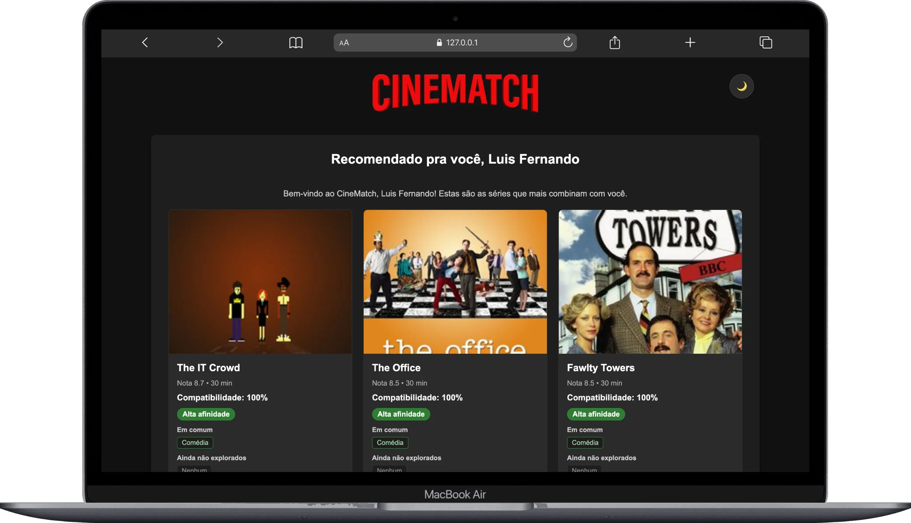
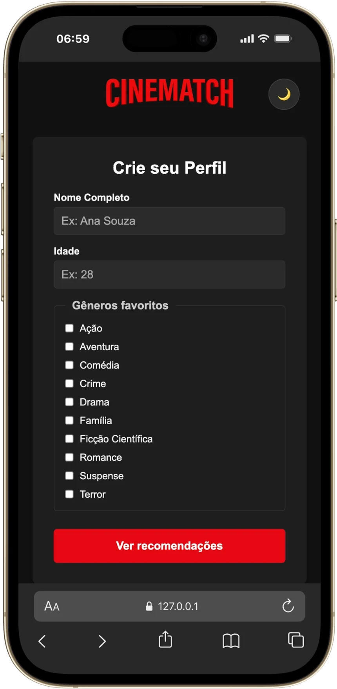
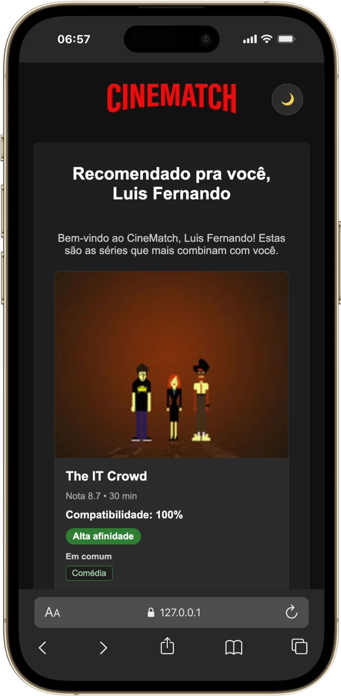
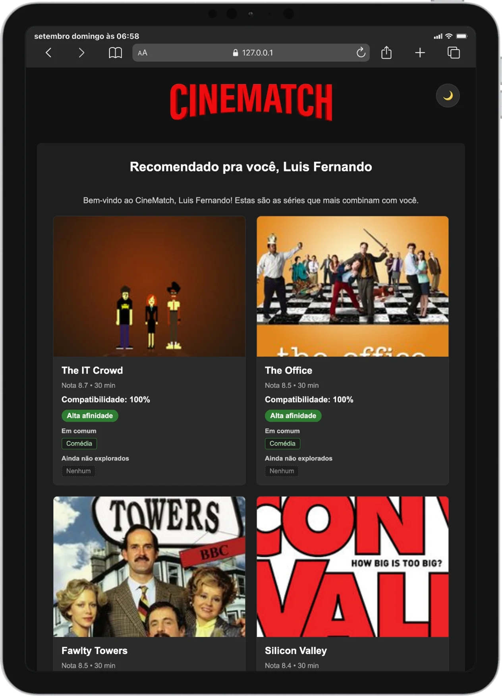

<p align="center">
  <a href="docs/screenshots/00-desktop.webp">
    
  </a>
</p>

<h1 align="center">🎬 CineMatch Web</h1>
<p align="center"><strong>Recomendação de séries em tempo real, direto do navegador.</strong></p>

<p align="center">
  
  
  
  
  
</p>

---

## Índice

- [Sobre o projeto](#sobre-o-projeto)
- [Funcionalidades obrigatórias](#funcionalidades-obrigatórias)
- [Melhorias opcionais](#melhorias-opcionais)
- [Tecnologias](#tecnologias)
- [Como executar](#como-executar)
- [Estrutura do projeto](#estrutura-do-projeto)
- [Arquitetura e decisões técnicas](#arquitetura-e-decisões-técnicas)
- [Testes realizados](#testes-realizados)
- [Capturas de tela](#capturas-de-tela)
- [Vídeo de apresentação](#vídeo-de-apresentação)
- [Autor](#autor)

> [!IMPORTANT]
> O catálogo de séries vem da **[TVMaze API](https://www.tvmaze.com/api)**, pública e sem necessidade de chave de acesso. Nenhuma credencial precisa ser configurada para rodar o projeto.

---

## Sobre o projeto

O **CineMatch** nasceu como um motor de recomendação que rodava só no terminal: a pessoa usuária digitava suas respostas, e o programa calculava a compatibilidade com um catálogo fictício de séries, tudo em texto puro no console.

O **CineMatch Web** evolui essa ideia para uma aplicação real, que qualquer pessoa abre no navegador — inclusive no celular. Ela:

- coleta o perfil da pessoa usuária (nome, idade e gêneros favoritos) por um formulário validado;
- guarda esse perfil no navegador com `localStorage`, para não pedir tudo de novo a cada visita;
- busca um catálogo real de séries em tempo real, na **[TVMaze API](https://www.tvmaze.com/api)**;
- reaproveita e adapta a lógica de POO, herança e compatibilidade do projeto original em terminal;
- renderiza tudo dinamicamente na tela, com cards estilizados e responsivos, do celular ao desktop.

Projeto avaliativo do **Módulo 1 — Desenvolvimento Mobile (React Native), SENAI**, desenvolvido em **JavaScript puro (Vanilla)**, sem frameworks, bundlers ou bibliotecas de UI — só HTML semântico, CSS com Flexbox e JavaScript com módulos ES.

---

## Funcionalidades obrigatórias

Todos os requisitos funcionais (RF01 a RF15) do desafio foram implementados:

| # | Requisito | Status |
|---|---|---|
| RF01 | HTML semântico (`header`, `main`, `section`, `article`, `footer`) | ✅ |
| RF02 | Formulário de perfil validado, com `preventDefault` e feedback de erro | ✅ |
| RF03 | Persistência do perfil com `localStorage` | ✅ |
| RF04 | Consumo da TVMaze API via `fetch`, com os 3 estados (carregando/vazio/erro) | ✅ |
| RF05 | Tratamento do catálogo com `filter`, `sort`, `slice` e `map` | ✅ |
| RF06 | Classes `Conteudo` e `Serie`, com herança e `this` | ✅ |
| RF07 | Cálculo e classificação da compatibilidade (Alta/Média/Baixa) | ✅ |
| RF08 | Renderização dinâmica dos cards no DOM | ✅ |
| RF09 | Responsividade com Flexbox, mobile-first | ✅ |
| RF10 | Callback disparado ao final do carregamento | ✅ |
| RF11 | Closure para contar recálculos da sessão | ✅ |
| RF12 | Mensagem de carregamento com `setTimeout` | ✅ |
| RF13 | SEO básico e acessibilidade (labels, alt, foco, contraste) | ✅ |
| RF14 | Código modularizado em ESM (`import`/`export`) | ✅ |
| RF15 | Servido localmente via `npm start` (live-server) | ✅ |

---

## Melhorias opcionais

Além do escopo obrigatório, foram implementadas cinco melhorias, todas com fallback seguro caso a API ou o navegador não cooperem:

- **🌗 Tema dark/light** — alternância com um clique, persistida no `localStorage` e aplicada antes da página renderizar (sem "flash" do tema errado).
- **📄 Catálogo ampliado e paginado** — busca em paralelo 4 páginas da TVMaze (`Promise.allSettled`), ampliando o catálogo de ~250 para ~1000 séries, com paginação de 8 recomendações por página no celular/tablet e 9 no desktop.
- **✨ Tela de loading animada** — logo centralizada, fundo desfocado e efeito sonoro ao buscar recomendações, com saída animada e suporte a `prefers-reduced-motion`.
- **🏷️ Gêneros dinâmicos** — os checkboxes do formulário vêm dos 10 gêneros mais frequentes do catálogo real, calculados com `reduce`/`sort`/`slice`, com fallback para uma lista fixa se a busca falhar.
- **♿ Acessibilidade reforçada** — `aria-invalid`, `aria-describedby`, `aria-live` e navegação 100% funcional por teclado.

<details>
<summary><strong>Ver detalhes técnicos de cada melhoria</strong></summary>

**Tema dark/light**
- Variáveis CSS (`--bg-pagina`, `--texto-principal`, `--acento`, etc.) redefinidas em `:root[data-theme="light"]`.
- Um script inline no `<head>` aplica o tema salvo antes do CSS renderizar.
- Badges de afinidade mantêm cores fixas nos dois temas, por serem cores semânticas.

**Catálogo ampliado e paginação**
- `Promise.allSettled` evita que a falha de uma página derrube as outras; só é tratado como erro se nenhuma página responder.
- `tratarCatalogo()` aceita um parâmetro de limite (padrão 60), no lugar do corte fixo em 8.
- `obterItensPorPagina()` usa `window.matchMedia` no mesmo breakpoint (1024px) do grid de cards, e a paginação reinicia na página 1 se a janela cruzar esse breakpoint.

**Tela de loading**
- Overlay com `aria-hidden`, já que é decorativo; a área de resultados usa `aria-live="polite"` para quem usa leitor de tela receber o status real.
- Som tocado com `try/catch`, sem travar a aplicação caso o navegador bloqueie áudio automático.

**Gêneros dinâmicos**
- Busca leve e separada (só `page=0`), independente da busca completa do catálogo, que só acontece após o envio do formulário.
- O botão "Ver recomendações" nasce desabilitado e só libera depois que os checkboxes existem (sucesso ou fallback).

**Acessibilidade**
- Campos com erro recebem `aria-invalid="true"` e `aria-describedby`, ligando o input à mensagem.
- Contraste do placeholder dos inputs ajustado manualmente (o padrão do navegador ficava fraco no tema escuro).

</details>

---

## Tecnologias

- **HTML5** semântico
- **CSS3** com Flexbox, variáveis de cor e media queries (mobile-first)
- **JavaScript ES6+**, modularizado com `import`/`export` (ESM)
- **[TVMaze API](https://www.tvmaze.com/api)** — catálogo de séries em tempo real
- **localStorage** — persistência do perfil e do tema
- **[live-server](https://www.npmjs.com/package/live-server)** — servidor local de desenvolvimento

Sem React, bundlers ou qualquer biblioteca de UI — o objetivo do módulo é dominar o JavaScript puro.

---

## Como executar

```bash
# 1. Clone o repositório
git clone https://github.com/kalfels/cinematch-web.git
cd cinematch-web

# 2. Instale as dependências de desenvolvimento
npm install

# 3. Rode o servidor local
npm start
```

O `live-server` abre o projeto automaticamente no navegador, geralmente em `http://127.0.0.1:8080`.

---

## Estrutura do projeto

```
cinematch-web/
│
├── assets/                      # Recursos usados PELA aplicação em produção
│   ├── logotipo.png             #   logo exibida no header e no loading
│   └── som-loading.mp3          #   efeito sonoro da tela de loading
│
├── docs/                        # Recursos só para documentação (não usados pelo app)
│   └── screenshots/
│       ├── 00-desktop.webp
│       ├── 01-mobile-formulario.webp
│       ├── 02-mobile-resultados.webp
│       └── 03-tablet-resultados.webp
│
├── index.html                   # Estrutura semântica da página
├── style.css                    # Todo o CSS (variáveis de tema, Flexbox, media queries)
│
├── script.js                    # Fluxo: formulário, localStorage, fetch, orquestração
├── ui.js                        # Tudo que toca a tela: cards, erros, tema, paginação
├── modelo.js                    # Dados: tratamento do catálogo, classes POO, closure
│
├── package.json
├── package-lock.json
├── .gitignore                   # ignora node_modules/
└── README.md
```

**Por que separar `assets/` de `docs/`?** `assets/` guarda apenas o que o próprio site carrega em tempo de execução (a logo e o som). `docs/screenshots/` guarda imagens usadas **só neste README**, para não misturar material de documentação com os recursos reais da aplicação.

**Por que só 3 arquivos JavaScript?** O desafio pede módulos ES organizados por responsabilidade, não um arquivo por funcionalidade. `script.js`, `ui.js` e `modelo.js` já cobrem isso com folga: mais divisão do que isso tende a fragmentar código que é lido e mudado sempre junto.

---

## Arquitetura e decisões técnicas

- **`modelo.js`** — sem nenhuma referência ao DOM. Guarda o tratamento do catálogo (`tratarCatalogo`, `extrairGenerosFrequentes`), as classes `Conteudo`/`Serie` (POO, herança e `this`) e a closure do contador (`criarContador`). Podia ser testado isoladamente, sem abrir um navegador.
- **`ui.js`** — tudo que lê ou escreve no DOM: renderização de cards, paginação, mensagens de erro, tema e o formulário de gêneros dinâmico. Não decide *quando* algo acontece, só *como* aparece na tela.
- **`script.js`** — orquestra o fluxo: liga eventos, decide a ordem das chamadas (buscar → tratar → calcular → renderizar) e é o único arquivo que conhece os outros dois.

<details>
<summary><strong>CommonJS x ESM</strong></summary>

- **CommonJS** (`require` / `module.exports`) foi usado no CineMatch JS original, que rodava no terminal com Node.js. Os módulos são carregados de forma síncrona.
- **ESM** (`import` / `export`) é o padrão oficial do JavaScript e o usado aqui, no navegador. Exige `<script type="module">` no HTML e um servidor local, pois o navegador bloqueia módulos abertos direto pelo arquivo (`file://`).
- Na prática: no CommonJS exportamos com `module.exports = { ... }`; no ESM usamos `export function` / `export class` e importamos com `import { ... } from './arquivo.js'`, sempre com a extensão `.js`.

</details>

<details>
<summary><strong>Compatibilidade e classificação (RF06/RF07)</strong></summary>

- `Conteudo` guarda `id`, `titulo`, `tipo`, `generos`, `duracaoMinutos` e `imagem`; `Serie extends Conteudo` acrescenta `nota` e sobrescreve `exibirResumo()` reaproveitando o método da classe base via `super`.
- Compatibilidade: `(gêneros em comum ÷ total de gêneros da série) × 100`, arredondada com `Math.round`.
- Classificação com `if / else if / else`: **Alta afinidade** (80% ou mais), **Média afinidade** (50% a 79%) e **Baixa afinidade** (abaixo de 50%).
- Gêneros não explorados montados com um laço `for...of`, separado do cálculo do percentual.

</details>

---

## Testes realizados

- Fluxo completo do zero: `localStorage` limpo → formulário → resultados → F5 → "Trocar perfil".
- Estado de **erro**: internet desligada durante a busca (DevTools → Network → Offline).
- Estado **vazio**: filtro forçado a não retornar nenhuma série.
- **Fallback dos gêneros**: URL da API bloqueada de propósito no DevTools.
- **Falha parcial**: uma das 4 páginas da API bloqueada, confirmando que as demais continuam funcionando.
- Responsividade em 375px (1 coluna), ~800px (2 colunas) e 1200px (3 colunas), nos dois temas.
- Navegação **só por teclado** (Tab): campos, checkboxes, botão de tema, envio, paginação e "Trocar perfil".
- Contraste de cor e placeholders conferidos nos dois temas.

---

## Capturas de tela

<table>
  <tr>
    <td align="center" width="33%">
      <br>
      <sub>Formulário de perfil (mobile)</sub>
    </td>
    <td align="center" width="33%">
      <br>
      <sub>Resultados (mobile)</sub>
    </td>
    <td align="center" width="33%">
      <br>
      <sub>Resultados (tablet)</sub>
    </td>
  </tr>
</table>

---

## Kanban do Projeto no Trello

🔗 *[(https://trello.com/b/O5jOr1as/cinematch-web)]*

---


## Vídeo de apresentação

📺 *[(https://youtu.be/P28D3YnTOXg)]*

---

<p align="center">
  <strong>CineMatch Web · Recomendação de séries em tempo real.</strong><br>
  <em>Terminal → Formulário → API → Compatibilidade → Recomendação.</em>
</p>

---

## Autor

Desenvolvido por **Luis Fernando** como projeto avaliativo do Módulo 1 (SENAI).

🔗 [github.com/kalfels](https://github.com/kalfels)